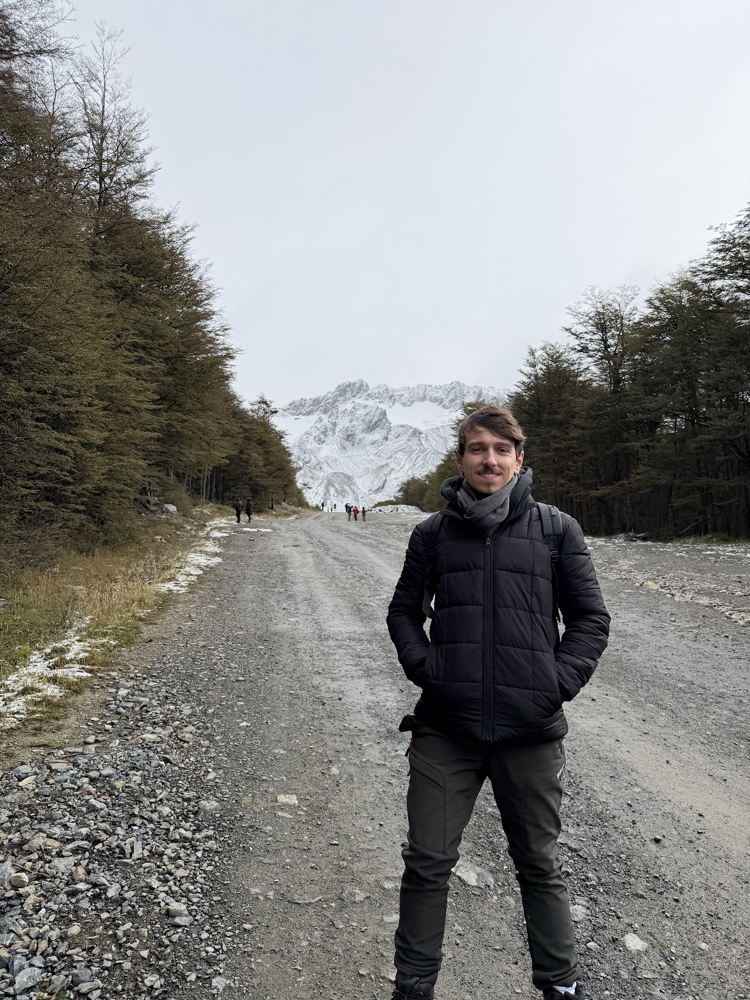
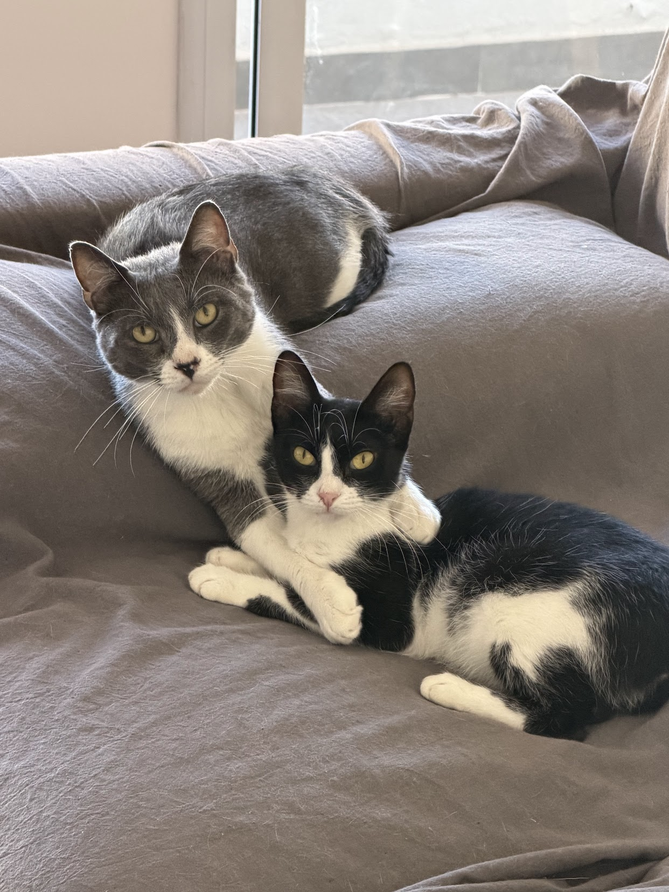

# Bienvenidos!

Mi nombre es Martiniano Baridón, me dicen Marti. Soy Ingeniero en sistemas de la UTN y trabajo hace varios años como Backend developer. Tuve la suerte de cursar con Alf en el año 2016, la cursada que más me gustó de toda la carrera. Tuve la oportunidad de sumarme como ayudante en 2017 pero por diversos motivos no pude en ese momento, así que este es mi primer año como ayudante (unos 9 años más tarde).

## Hobbies 🎸 ✈️

Me encanta la música, principalmente el punk rock y el metal moderno. Toco la guitarra y fui a demasiados recitales. Los últimos a los que fui y me volaron la cabeza fueron: Turnstile, Linkin Park, Avenged Sevenfold, Deny.

También tengo una banda con unos amigos del secundario: Prymordial. Si quieren chusmear lo que hacemos: [link](https://www.instagram.com/prymordial/).

Me gusta mucho viajar. La última ciudad a la que fui fue Ushuaia en marzo de este año. Fuera de nuestro país, pude conocer Canadá (no recomendado para los que no les gusta el frío, la temperatura puede llegar a -17 grados 🥶).

## Michis 🐈

Tengo 2 gatos: Balú y Mía, ambos adoptados durante el 2025.

